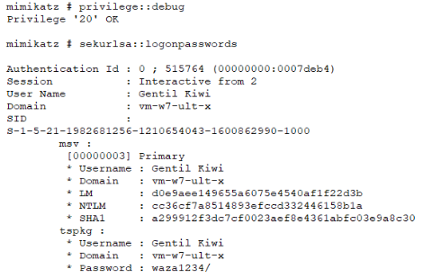
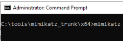

# Récupérer Hash mot de passe administrateur dans windows server 2022

Etant bloqué sur le décryptage de hachage de type yescrypt, nous avons décidé de contourner le problème par l'intermédiaire de l'application Mimikatz. Cet outil permet de récupérer le mots de passe en SHA1 ce qui enlève le problème du hachage de type yescrypt que nous pensions indéchiffrable par l'intermédiaire de John The Ripper.

Mimikatz est une alternative puissante pour extraire les hachages de mots de passe. Voici comment l'utiliser sur Windows Server 2022 :

1. **Télécharger Mimikatz :**
   -  Aller sur le dépôt GitHub officiel de Mimikatz : [Mimikatz GitHub](https://github.com/gentilkiwi/mimikatz).

Si on ouvre le fichier Readme de Mimikatz, on constate qu’il est très bien expliqué, comme on peut le constater, il montre les commandes principales à taper ainsi que le résultat, voici une copie d’écran :

1. **Préparer Mimikatz :**
- Décompresser le fichier téléchargé dans un répertoire accessible, par exemple C:\tools\mimikatz
1. **Exécuter Mimikatz avec des privilèges administratifs** 
-  Ouvrir l'invite de commande en tant qu'administrateur

 

- Se rendre dans le répertoire de Mimikatz

 

- Exécuter Mimikatz

 

- Voici le terminal Mimikatz une fois lancé
  
 

- Taper la première commande
  
 

La commande ` privilege::debug ` dans Mimikatz sert à activer le privilège « SeDebugPrivilege » pour le processus en cours. Ce privilège est nécessaire pour permettre à Mimikatz d'accéder à certaines fonctions critiques du système, notamment pour lire les informations de sécurité et les données sensibles stockées en mémoire.

**Pourquoi activer SeDebugPrivilege ?**

1. **Accès aux informations sensibles** : Permet à Mimikatz de lire les informations d'authentification stockées en mémoire par des processus comme lsass.exe (Local Security Authority Subsystem Service). Ces informations peuvent inclure des hachages de mots de passe, des tickets Kerberos, des mots de passe en clair, etc.
1. **Interaction avec d'autres processus** : Permet d'accéder et de manipuler des processus qui, autrement, seraient protégés ou limités en termes de permissions d'accès.

- Taper la deuxième et dernière commande

 

La commande sekurlsa dans Mimikatz est une commande qui permet d'accéder aux informations relatives aux processus d'authentification en mémoire sur un système Windows. Elle est principalement utilisée pour extraire les informations de connexion, telles que les hachages de mots de passe, les tickets Kerberos, et d'autres données sensibles stockées par le système pour gérer les authentifications.

**Détails sur sekurlsa**

- **Objectif** : La commande sekurlsa est utilisée pour interagir avec le sous-système de sécurité Local Security Authority (LSA) de Windows, qui gère l'authentification et la sécurité des comptes utilisateur locaux et des ressources du système.
- **Fonctionnalités** : Elle offre plusieurs sous-commandes qui permettent d'accéder à différentes parties de la mémoire où sont stockées les informations d'authentification, telles que les hachages de mots de passe et les tickets Kerberos.

**Principales sous-commandes de sekurlsa**

1. **` sekurlsa::logonpasswords `** :

Cette sous-commande extrait les informations de connexion stockées en mémoire, y compris les hachages de mots de passe et, dans certains cas, les mots de passe en clair des comptes utilisateur.

1. **` sekurlsa::tickets `** :

Elle permet d'afficher les tickets Kerberos (TGT et TGS) actuellement disponibles sur le système. Ces tickets peuvent être utilisés pour accéder à des ressources réseau.

1. **` sekurlsa::pth `** :

Utilisé pour l'authentification Pass-the-Hash, cette sous-commande permet de créer un jeton d'accès en utilisant un hachage de mot de passe plutôt que le mot de passe en clair.

1. **` sekurlsa::ekeys `** :

Affiche les clés d'exportation de session (session keys) qui peuvent être utilisées pour déchiffrer les communications chiffrées entre les clients et les serveurs.

**Resultat de la dernière commande ` sekurlsa::logonpasswords `**

 

**Explications données intéressantes dont Hash du mot de passe admin:**

- **NTLM** : 8846f7eaee8fb117ad06bdd830b7586c

C'est le hachage NTLM du mot de passe de l'utilisateur Administrator.

- **SHA1** : 1e9b6ec29919db9e0d824e4740d84b14a6299e6d

C'est le hachage SHA1 du mot de passe de l'utilisateur Administrator.

- **DAPI (dpapi)** :

Les informations sous dpapi montrent que des données protégées par la Data Protection API peuvent être présentes.

**Conclusion** : il ne reste plus qu’à se connecter en SSH à windows server 2022 pour transférer ce mot de passe de type SHA1 et le déchiffrer
